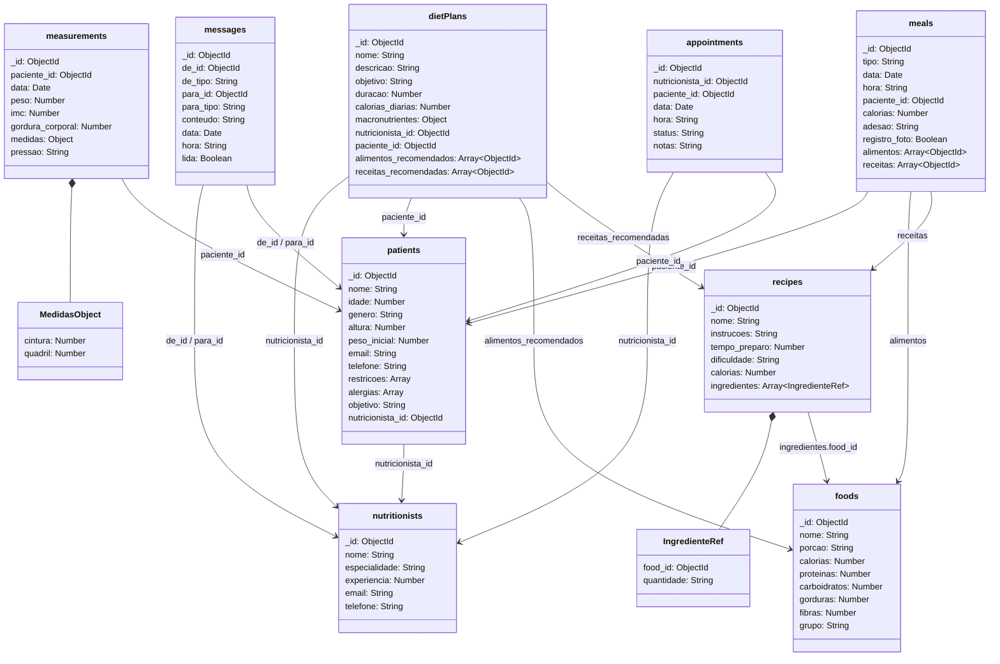

# Modelo de Documentos (MongoDB)

O modelo de documentos para nosso Sistema de Acompanhamento de Dietas utiliza o MongoDB, um banco de dados NoSQL orientado a documentos que armazena dados em formato JSON-like (BSON). Esta abordagem é particularmente útil para representar estruturas aninhadas e quando a flexibilidade de esquema é importante.

## Diagrama do Modelo

O diagrama abaixo ilustra o modelo de dados em formato de documentos:



## Coleções e Documentos

O modelo utiliza as seguintes coleções:

### nutritionists

Armazena informações sobre os nutricionistas.

```javascript
{
  "_id": 1,
  "nome": "Ana Silva",
  "especialidade": "Nutrição Esportiva",
  "experiencia": 8,
  "email": "ana@nutri.com",
  "telefone": "21-99999-1111"
}
```

### patients

Armazena informações sobre os pacientes, incluindo referência ao nutricionista que os atende.

```javascript
{
  "_id": 1,
  "nome": "João Pereira",
  "idade": 35,
  "genero": "M",
  "altura": 178,
  "peso_inicial": 92,
  "email": "joao@email.com",
  "telefone": "21-88888-1111",
  "restricoes": ["Glúten"],
  "alergias": ["Amendoim"],
  "objetivo": "Emagrecimento",
  "nutricionista_id": 1
}
```

### foods

Cadastro de alimentos com informações nutricionais.

```javascript
{
  "_id": 1,
  "nome": "Maçã",
  "porcao": "1 unidade (150g)",
  "calorias": 95,
  "proteinas": 0.5,
  "carboidratos": 25,
  "gorduras": 0.3,
  "fibras": 4.4,
  "grupo": "Frutas"
}
```

### recipes

Receitas com ingredientes e instruções.

```javascript
{
  "_id": 1,
  "nome": "Salada de Frango com Abacate",
  "instrucoes": "Corte o peito de frango em cubos e grelhe. Misture com abacate, tomate e folhas verdes. Tempere com azeite, limão e sal.",
  "tempo_preparo": 20,
  "dificuldade": "Fácil",
  "calorias": 320,
  "ingredientes": [
    {"food_id": 2, "quantidade": "100g"},
    {"food_id": 4, "quantidade": "50g"},
    {"food_id": 9, "quantidade": "5ml"}
  ]
}
```

### dietPlans

Planos alimentares com referências a pacientes, nutricionistas e alimentos/receitas recomendados.

```javascript
{
  "_id": a1,
  "nome": "Emagrecimento Saudável",
  "descricao": "Plano focado em déficit calórico moderado com alimentos nutritivos",
  "objetivo": "Perda de peso",
  "duracao": 90,
  "calorias_diarias": 1800,
  "macronutrientes": {
    "proteinas": "30%",
    "carboidratos": "40%",
    "gorduras": "30%"
  },
  "nutricionista_id": 1,
  "paciente_id": 1,
  "alimentos_recomendados": [2, 3, 4],
  "receitas_recomendadas": [1, 5]
}
```

### meals

Refeições consumidas pelos pacientes.

```javascript
{
  "_id": 1,
  "tipo": "Café da manhã",
  "data": ISODate("2023-10-18T00:00:00Z"),
  "hora": "08:00",
  "paciente_id": 1,
  "calorias": 320,
  "adesao": "Completa",
  "registro_foto": true,
  "alimentos": [],
  "receitas": [4]
}
```

### measurements

Histórico de medidas corporais dos pacientes.

```javascript
{
  "_id": 1,
  "paciente_id": 1,
  "data": ISODate("2023-09-15T00:00:00Z"),
  "peso": 92,
  "imc": 29.1,
  "gordura_corporal": 28,
  "medidas": {
    "cintura": 102,
    "quadril": 106
  },
  "pressao": "130/85"
}
```

### messages

Comunicações entre pacientes e nutricionistas.

```javascript
{
  "_id": 1,
  "de_id": 1,
  "de_tipo": "nutricionista",
  "para_id": 1,
  "para_tipo": "paciente",
  "conteudo": "Como está se sentindo com a nova dieta?",
  "data": ISODate("2023-10-15T00:00:00Z"),
  "hora": "14:30",
  "lida": true
}
```

### appointments

Consultas agendadas e realizadas.

```javascript
{
  "_id": 1,
  "nutricionista_id": 1,
  "paciente_id": 1,
  "data": ISODate("2023-09-15T00:00:00Z"),
  "hora": "14:00",
  "status": "Realizada",
  "notas": "Avaliação inicial e definição de plano alimentar"
}
```

## Estratégias de Modelagem

No modelo MongoDB, utilizamos algumas estratégias específicas:

### 1. Referências vs. Embutimento

- **Referências**: Utilizamos IDs para relacionar documentos entre coleções (ex: `nutricionista_id` em `patients`).
- **Embutimento**: Utilizamos documentos embutidos para dados que são acessados em conjunto frequentemente (ex: `medidas` em `measurements`).

### 2. Arrays de Referências

Para relações de muitos-para-muitos, utilizamos arrays de IDs:
- `alimentos_recomendados` e `receitas_recomendadas` em `dietPlans`
- `alimentos` e `receitas` em `meals`

### 3. Objetos para Dados Complexos

Para dados estruturados que pertencem logicamente a um único documento:
- `macronutrientes` em `dietPlans`
- `medidas` em `measurements`

### 4. Tipos Discriminados

Para mensagens, usamos campos discriminadores para identificar o tipo:
- `de_tipo` e `para_tipo` em `messages` (pode ser "nutricionista" ou "paciente")

## Vantagens do Modelo de Documentos

- **Esquema flexível**: Facilidade para evoluir o modelo sem migrações complexas
- **Documentos auto-contidos**: Redução de JOINs para operações comuns
- **Estruturas aninhadas**: Representação natural de dados hierárquicos
- **Consultas poderosas**: Framework de agregação para análises complexas
- **Escalonamento horizontal**: Facilidade para distribuir dados em clusters

Este modelo de documentos nos permite armazenar e consultar eficientemente os dados do sistema de acompanhamento de dietas, especialmente quando precisamos:

- Recuperar todas as informações de um paciente em uma única operação
- Armazenar estruturas complexas como ingredientes de receitas
- Realizar análises agregadas sobre medidas corporais ou consumo alimentar
- Flexibilidade para adicionar novos campos ou tipos de dados no futuro

A capacidade do MongoDB de consultar e agregar dados de forma eficiente o torna uma escolha excelente para esta aplicação.