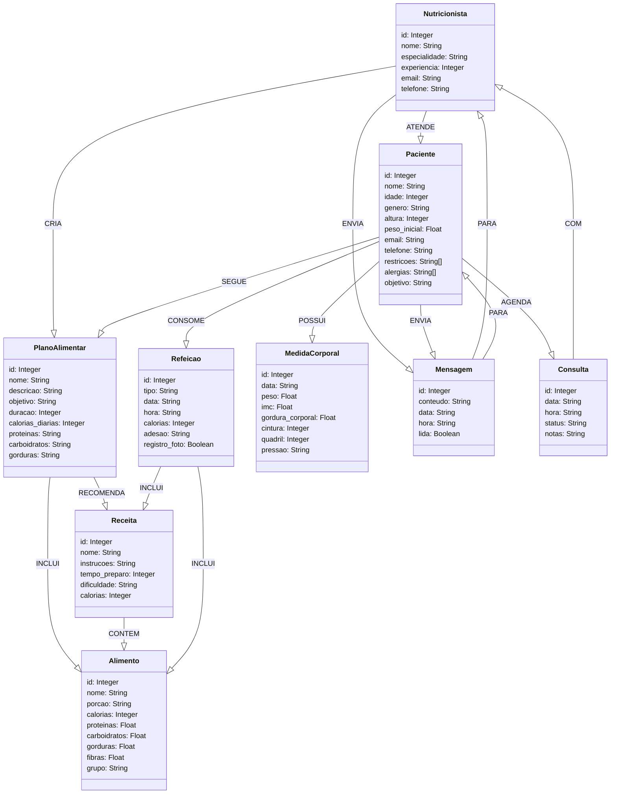

# Modelo de Grafos (Neo4j)

O modelo de grafos para nosso Sistema de Acompanhamento de Dietas utiliza o Neo4j, um banco de dados baseado em grafos que representa os dados como nós (entidades) e relacionamentos (arestas). Esta representação é particularmente adequada para nosso domínio, pois permite modelar facilmente as complexas relações entre nutricionistas, pacientes, planos alimentares, receitas, etc.

## Diagrama do Modelo

O diagrama abaixo ilustra o modelo de dados em formato de grafo:



## Nós (Entidades)

O modelo define os seguintes tipos de nós:

### Nutricionista
Profissionais que orientam os pacientes
```cypher
CREATE (n:Nutricionista {
    id: 1, 
    nome: "Ana Silva", 
    especialidade: "Nutrição Esportiva", 
    experiencia: 8, 
    email: "ana@nutri.com", 
    telefone: "21-99999-1111"
})
```

### Paciente
Pessoas que buscam orientação nutricional
```cypher
CREATE (p:Paciente {
    id: 1, 
    nome: "João Pereira", 
    idade: 35, 
    genero: "M", 
    altura: 178, 
    peso_inicial: 92, 
    email: "joao@email.com", 
    telefone: "21-88888-1111", 
    restricoes: ["Glúten"], 
    alergias: ["Amendoim"], 
    objetivo: "Emagrecimento"
})
```

### PlanoAlimentar
Dietas elaboradas para os pacientes
```cypher
CREATE (pa:PlanoAlimentar {
    id: 1, 
    nome: "Emagrecimento Saudável", 
    descricao: "Plano focado em déficit calórico moderado com alimentos nutritivos", 
    objetivo: "Perda de peso", 
    duracao: 90, 
    calorias_diarias: 1800, 
    proteinas: "30%", 
    carboidratos: "40%", 
    gorduras: "30%"
})
```

### Alimento
Itens alimentares básicos com informações nutricionais
```cypher
CREATE (a:Alimento {
    id: 1, 
    nome: "Maçã", 
    porcao: "1 unidade (150g)", 
    calorias: 95, 
    proteinas: 0.5, 
    carboidratos: 25, 
    gorduras: 0.3, 
    fibras: 4.4, 
    grupo: "Frutas"
})
```

### Receita
Combinações de alimentos com instruções de preparo
```cypher
CREATE (r:Receita {
    id: 1, 
    nome: "Salada de Frango com Abacate", 
    instrucoes: "Corte o peito de frango em cubos e grelhe. Misture com abacate, tomate e folhas verdes. Tempere com azeite, limão e sal.", 
    tempo_preparo: 20, 
    dificuldade: "Fácil", 
    calorias: 320
})
```

### Refeicao
Registros de alimentação dos pacientes
```cypher
CREATE (ref:Refeicao {
    id: 1, 
    tipo: "Café da manhã", 
    data: "2023-10-18", 
    hora: "08:00", 
    calorias: 320, 
    adesao: "Completa", 
    registro_foto: true
})
```

### MedidaCorporal
Histórico de medições (peso, IMC, etc.)
```cypher
CREATE (m:MedidaCorporal {
    id: 1, 
    data: "2023-09-15", 
    peso: 92, 
    imc: 29.1, 
    gordura_corporal: 28, 
    cintura: 102, 
    quadril: a106, 
    pressao: "130/85"
})
```

### Mensagem
Comunicações entre nutricionistas e pacientes
```cypher
CREATE (msg:Mensagem {
    id: 1, 
    conteudo: "Como está se sentindo com a nova dieta?", 
    data: "2023-10-15", 
    hora: "14:30", 
    lida: true
})
```

### Consulta
Agendamentos de atendimentos
```cypher
CREATE (c:Consulta {
    id: 1, 
    data: "2023-09-15", 
    hora: "14:00", 
    status: "Realizada", 
    notas: "Avaliação inicial e definição de plano alimentar"
})
```

## Relacionamentos

Os relacionamentos modelam as conexões entre os nós:

1. **ATENDE**: Nutricionista → Paciente
   ```cypher
   MATCH (n:Nutricionista {id: 1}), (p:Paciente {id: 1})
   CREATE (n)-[:ATENDE]->(p)
   ```

2. **CRIA**: Nutricionista → PlanoAlimentar
   ```cypher
   MATCH (n:Nutricionista {id: 1}), (pa:PlanoAlimentar {id: 1})
   CREATE (n)-[:CRIA]->(pa)
   ```

3. **SEGUE**: Paciente → PlanoAlimentar
   ```cypher
   MATCH (p:Paciente {id: 1}), (pa:PlanoAlimentar {id: 1})
   CREATE (p)-[:SEGUE]->(pa)
   ```

4. **INCLUI**: PlanoAlimentar → Alimento
   ```cypher
   MATCH (pa:PlanoAlimentar {id: 1}), (a:Alimento {id: 2})
   CREATE (pa)-[:INCLUI]->(a)
   ```

5. **RECOMENDA**: PlanoAlimentar → Receita
   ```cypher
   MATCH (pa:PlanoAlimentar {id: 1}), (r:Receita {id: 1})
   CREATE (pa)-[:RECOMENDA]->(r)
   ```

6. **CONTEM**: Receita → Alimento
   ```cypher
   MATCH (r:Receita {id: 1}), (a:Alimento {id: 2})
   CREATE (r)-[:CONTEM {quantidade: "100g"}]->(a)
   ```

7. **CONSOME**: Paciente → Refeicao
   ```cypher
   MATCH (p:Paciente {id: 1}), (r:Refeicao {id: 1})
   CREATE (p)-[:CONSOME]->(r)
   ```

8. **INCLUI**: Refeicao → (Alimento | Receita)
   ```cypher
   MATCH (ref:Refeicao {id: 1}), (r:Receita {id: 4})
   CREATE (ref)-[:INCLUI]->(r)
   ```

9. **POSSUI**: Paciente → MedidaCorporal
   ```cypher
   MATCH (p:Paciente {id: 1}), (m:MedidaCorporal {id: 1})
   CREATE (p)-[:POSSUI]->(m)
   ```

10. **ENVIA/PARA**: Mensagens entre Nutricionista e Paciente
    ```cypher
    MATCH (n:Nutricionista {id: 1}), (msg:Mensagem {id: 1}), (p:Paciente {id: 1})
    CREATE (n)-[:ENVIA]->(msg)-[:PARA]->(p)
    ```

11. **AGENDA/COM**: Consultas entre Paciente e Nutricionista
    ```cypher
    MATCH (p:Paciente {id: 1}), (c:Consulta {id: A1}), (n:Nutricionista {id: 1})
    CREATE (p)-[:AGENDA]->(c)-[:COM]->(n)
    ```

## Vantagens do Modelo de Grafos

- **Navegabilidade natural**: Facilidade para percorrer relacionamentos complexos
- **Consultas de caminhos**: Possibilidade de encontrar padrões de relacionamento
- **Desempenho em consultas relacionais**: Boa performance para consultas que envolvem múltiplos relacionamentos
- **Modelagem intuitiva**: Representação que se assemelha à forma como pensamos sobre os dados
- **Flexibilidade**: Facilidade para adicionar novos tipos de nós e relacionamentos

Este modelo de grafos nos permite responder a perguntas complexas sobre o sistema de acompanhamento de dietas, como:

- Quais receitas são adequadas para pacientes com certas restrições alimentares?
- Qual o histórico de progresso de um paciente ao longo do tempo?
- Quais nutricionistas têm mais pacientes com objetivo de emagrecimento?
- Qual o padrão de comunicação entre nutricionistas e pacientes?

A capacidade do Neo4j de navegar relacionamentos de forma eficiente torna-o ideal para este tipo de aplicação.