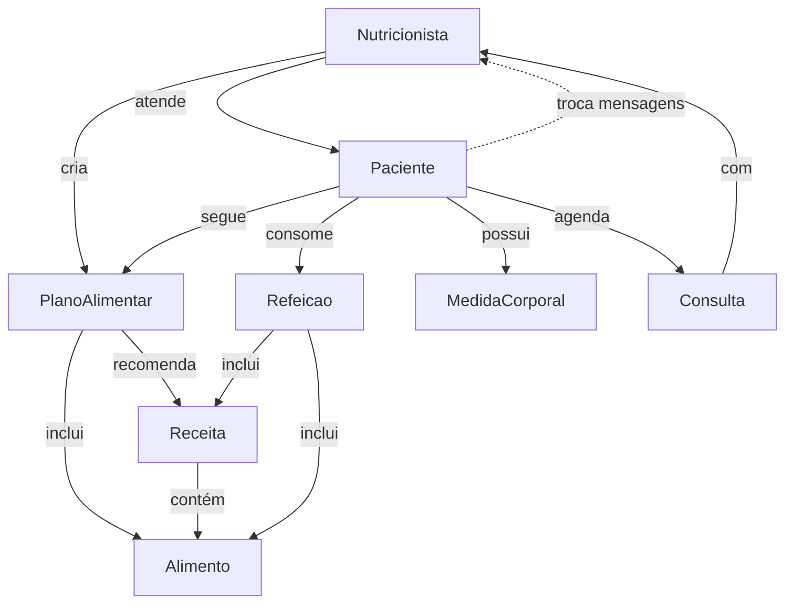

# Modelagem de Dados

O Sistema de Acompanhamento de Dietas utiliza dois tipos diferentes de bancos de dados NoSQL para demonstrar as capacidades e características específicas de cada um:

## Bancos de Dados Utilizados

1. **Neo4j (Banco de Dados de Grafos)**
   - Utilizado para modelar relacionamentos complexos entre entidades
   - Permite consultas baseadas em padrões de grafos
   - Ideal para dados altamente conectados

2. **MongoDB (Banco de Dados de Documentos)**
   - Utilizado para armazenar documentos complexos com estrutura flexível
   - Permite consultas e agregações poderosas
   - Ideal para dados aninhados e esquema flexível

## Modelos Implementados

Clique nos links abaixo para ver os detalhes de cada modelo:

- [**Modelo de Grafos (Neo4j)**](grafos.md) - Representa entidades como nós e relacionamentos como arestas
- [**Modelo de Documentos (MongoDB)**](documentos.md) - Organiza os dados em coleções de documentos JSON

## Diagrama Conceitual

O diagrama abaixo mostra uma visão conceitual das principais entidades do sistema:

